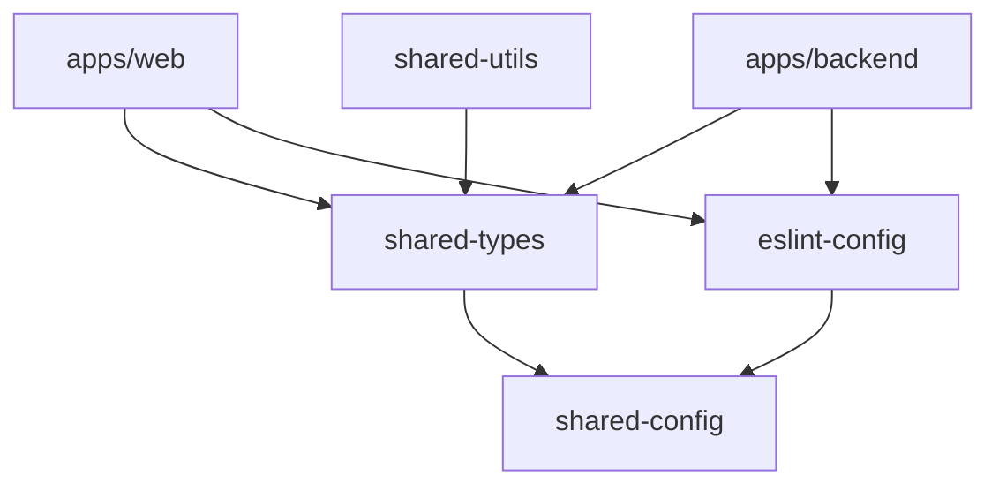

<div align="center">

# 🚀 Turborepo SaaS Starter

> **⚠️ NOT PRODUCTION READY YET**
> This project is currently under active development and is not recommended for production use. Features may be incomplete, breaking changes may occur, and documentation is still being finalized.

**Monorepo for building modern SaaS applications**

[](https://turbo.build)
[](https://nuxt.com)
[](https://adonisjs.com)
[](https://www.typescriptlang.org)
[](https://pnpm.io)

*A fully-featured, enterprise-grade monorepo with frontend, backend, CMS, and shared packages*

[Features](#-features) • [Quick Start](#-quick-start) • [Architecture](#-architecture) • [Testing](./TESTING.md) • [Documentation](#-documentation)

</div>

---

## ✨ Features

### 🏗️ **Monorepo Architecture**
- **Turborepo** - High-performance build system with intelligent caching
- **pnpm Workspaces** - Fast, disk space efficient package management
- **Shared Packages** - Reusable types, utilities, and configurations

### 🎨 **Modern Frontend**
- **Nuxt 4** - The Intuitive Vue Framework with server-side rendering
- **Nuxt UI Pro** - Beautiful, accessible components built on Radix Vue
- **TypeScript** - Full type safety across the entire stack
- **Directus** - Headless CMS for content management
- **Visual Editing** - Live preview and editing with Directus integration

### ⚡ **Powerful Backend**
- **AdonisJS 6** - Elegant Node.js framework with full TypeScript support
- **SQLite/PostgreSQL** - Flexible database options with Lucid ORM
- **Authentication** - Built-in auth system with session management
- **API Documentation** - Auto-generated Swagger/OpenAPI docs

### 💳 **Billing & Subscriptions**
- **Lago** - Open-source billing platform for modern SaaS
  - Subscription management (recurring billing, tiers)
  - Usage-based billing (metered/pay-as-you-go)
  - Multi-gateway support (Stripe, PayPal, Adyen)
  - Invoice generation with tax handling
  - REST API for easy integration
  - Beautiful Admin Dashboard

### 🛠️ **Developer Experience**
- **ESLint 9** - Modern flat config with shared rules across workspace
- **Prettier** - Consistent code formatting
- **TypeScript Project References** - Fast incremental builds
- **Hot Module Replacement** - Lightning-fast development workflow
- **Docker** - Containerized development and deployment
- **Testing** - Vitest for unit tests, Playwright for E2E tests

### 🔒 **Production Ready**
- **Type-safe APIs** - End-to-end type safety with TypeScript
- **Security Headers** - nuxt-security module configured
- **SEO Optimized** - Meta tags, sitemaps, and structured data
- **Performance** - Optimized builds with tree-shaking and code splitting

---

## 📁 Project Structure

```
turborepo-saas-starter/
├── apps/
│   ├── web/                    # Nuxt 4 frontend application
│   │   ├── app/               # Nuxt app directory
│   │   ├── server/            # Nuxt server routes & API
│   │   ├── content/           # Content files (blog, docs, changelog)
│   │   └── shared/            # App-specific shared code
│   │
│   ├── backend/               # AdonisJS API server
│   │   ├── app/              # Controllers, models, middleware
│   │   ├── config/           # Configuration files
│   │   ├── database/         # Migrations and seeders
│   │   └── start/            # Kernel and routes
│   │
│   └── cms/                   # Directus headless CMS
│       └── directus/         # Directus instance
│
├── packages/
│   ├── eslint-config/        # Shared ESLint configurations
│   │   ├── base.js          # Base rules for all projects
│   │   ├── typescript.js    # TypeScript-specific rules
│   │   ├── vue.js           # Vue/Nuxt rules
│   │   └── node.js          # Node.js/backend rules
│   │
│   ├── shared-config/        # Shared configurations
│   │   └── tsconfig.base.json  # Base TypeScript config
│   │
│   ├── shared-types/         # Shared TypeScript types
│   │   └── src/
│   │       ├── index.ts     # Common types
│   │       └── schema.ts    # Generated Directus schema
│   │
│   └── shared-utils/         # Shared utility functions
│       └── src/
│           └── index.ts     # Utility functions
│
└── docs/                      # Documentation
    ├── TOOLING_SETUP.md      # ESLint, Prettier, TypeScript setup
    ├── PACKAGE_FIXES.md      # Package configuration guide
    └── ...                   # Additional documentation
```

---

## 🚀 Quick Start

### Prerequisites

- **Node.js** >= 18.0.0
- **pnpm** >= 9.0.0
- **Docker** (optional, for CMS)

### Installation

```bash
# Clone the repository
git clone https://github.com/yourusername/turborepo-saas-starter.git
cd turborepo-saas-starter

# Install dependencies
pnpm install

# Start Directus CMS (optional)
pnpm docker:up

# Start development servers
pnpm dev
```

This will start:
- 🌐 **Frontend** at http://localhost:3000
- 🔌 **Backend API** at http://localhost:3333
- 📦 **Directus CMS** at http://localhost:8055

### Environment Setup

Create `.env` files in each app:

```bash
# apps/web/.env
NUXT_PUBLIC_SITE_URL=http://localhost:3000
DIRECTUS_URL=http://localhost:8055
NUXT_PUBLIC_ENABLE_VISUAL_EDITING=true

# apps/backend/.env
PORT=3333
HOST=0.0.0.0
NODE_ENV=development
APP_KEY=your-secret-key-here
SESSION_DRIVER=cookie

# Lago Billing Configuration
LAGO_API_URL=http://localhost:3100
LAGO_API_KEY=your-lago-api-key

# Payment Gateway (Stripe example)
STRIPE_SECRET_KEY=sk_test_your_stripe_key
STRIPE_PUBLISHABLE_KEY=pk_test_your_stripe_key
```

---

## 💻 Development

### Available Scripts

```bash
# Development
pnpm dev              # Start all apps in development mode
pnpm dev --filter web # Start only the web app

# Building
pnpm build           # Build all apps for production
pnpm build --filter backend # Build only the backend

# Code Quality
pnpm lint            # Lint all packages
pnpm lint:fix        # Fix linting issues
pnpm format          # Format code with Prettier
pnpm type-check      # Type check with TypeScript

# Testing
pnpm test            # Run unit tests (Vitest)
cd apps/web && pnpm test:ui # Unit tests with UI
pnpm test:e2e        # Run E2E tests (Playwright)
pnpm test:e2e:ui     # E2E tests with UI

# See TESTING.md for full testing documentation

# Docker
pnpm docker:up       # Start Docker services
pnpm docker:down     # Stop Docker services
pnpm docker:build    # Rebuild Docker containers

# Cleanup
pnpm clean           # Remove build artifacts and node_modules
```

### Adding a New Package

```bash
# Create package directory
mkdir -p packages/my-package/src

# Create package.json
cat > packages/my-package/package.json << EOF
{
  "name": "@turborepo-saas-starter/my-package",
  "version": "1.0.0",
  "private": true,
  "main": "./dist/index.js",
  "types": "./dist/index.d.ts",
  "exports": {
    ".": {
      "types": "./dist/index.d.ts",
      "import": "./dist/index.js"
    }
  },
  "scripts": {
    "build": "tsc",
    "dev": "tsc --watch",
    "type-check": "tsc --noEmit"
  }
}
EOF

# Install dependencies
pnpm install
```

---

## 🏛️ Architecture

### Monorepo Benefits

- **Code Sharing** - Share types, utilities, and configs across apps
- **Atomic Changes** - Make changes across multiple packages in one PR
- **Consistent Tooling** - Single ESLint, Prettier, and TypeScript config
- **Optimized Builds** - Turborepo caches and parallelizes builds
- **Type Safety** - End-to-end type safety with TypeScript project references

### Tech Stack

#### Frontend (Nuxt App)
```typescript
Nuxt 4 + Vue 3
├── Nuxt UI Pro          // Component library
├── Radix Vue            // Headless UI primitives
├── Tailwind CSS         // Utility-first CSS
├── VeeValidate + Zod    // Form validation
├── @directus/sdk        // CMS integration
└── Nuxt Content         // File-based CMS
```

#### Backend (AdonisJS)
```typescript
AdonisJS 6
├── Lucid ORM           // Database ORM
├── Auth Module         // Authentication
├── Validator (Vine)    // Request validation
├── Swagger             // API documentation
└── Better-SQLite3      // Database driver
```

#### CMS (Directus)
```typescript
Directus
├── PostgreSQL/SQLite   // Database
├── Visual Editing SDK  // Live preview
└── Type Generation     // TypeScript types
```

#### Billing (Lago)
```typescript
Lago
├── Subscription Management   // Recurring billing, tiers
├── Usage-Based Billing      // Metered billing
├── Invoice Generation       // PDF invoices, tax
├── REST APIs                // Easy integration
├── Multi-Gateway Support    // Stripe, PayPal, Adyen
└── Admin Dashboard          // Billing management UI
```

### Package Dependencies



---

## 💳 Lago Billing Integration

### Setup Lago

```bash
# Using Docker Compose (included in project)
docker-compose up -d

# Access Lago Admin Dashboard
open http://localhost:3001

# Create your first plan via API
curl -X POST http://localhost:3100/api/v1/plans \
  -H "Authorization: Bearer YOUR_API_KEY" \
  -H "Content-Type: application/json" \
  -d '{"plan": {"code": "starter", "name": "Starter Plan", "interval": "monthly", "amount_cents": 2900}}'
```

### Features

#### 💰 **Subscription Management**
- Recurring billing (monthly, yearly, weekly)
- Tiered pricing and seat-based billing
- Free trials and grace periods
- Upgrade/downgrade handling
- Proration support

#### 📊 **Usage-Based Billing**
- Track API calls, storage, compute
- Metered billing (pay-as-you-go)
- Custom billable metrics
- Real-time usage tracking
- Aggregation rules (sum, count, max, etc.)

#### 🧾 **Invoice Management**
- Automatic invoice generation
- PDF invoices with custom branding
- Tax calculation and handling
- Multiple currencies support
- Dunning management (failed payments)

#### 🔌 **Multi-Gateway Support**
- **Stripe** - Credit cards, ACH, SEPA
- **PayPal** - PayPal accounts
- **Adyen** - Global payment methods
- Custom payment providers via API

#### 🎨 **Admin Dashboard**
- Customer management
- Plan configuration
- Invoice viewing
- Real-time analytics
- Webhook management

### Example Integration

```typescript
// apps/backend/app/services/billing_service.ts
import BillingService from '#services/billing_service';

// Create customer
const customer = await BillingService.createCustomer({
  externalId: user.id,
  name: user.fullName,
  email: user.email,
  currency: 'USD',
});

// Create subscription
const subscription = await BillingService.createSubscription({
  externalCustomerId: user.id,
  planCode: 'starter',
  name: 'Starter Subscription',
});

// Track usage (for metered billing)
await BillingService.sendEvent({
  transactionId: `api_${Date.now()}`,
  externalCustomerId: user.id,
  code: 'api_calls',
  properties: { endpoint: '/api/data' },
});

// Get customer invoices
const invoices = await BillingService.getInvoices(user.id);
```

### Documentation

See [**LAGO_INTEGRATION.md**](./LAGO_INTEGRATION.md) for complete setup and usage guide

---

## 📚 Documentation

### Core Documentation
- [**Tooling Setup**](./docs/TOOLING_SETUP.md) - ESLint, Prettier, TypeScript configuration
- [**Package Fixes**](./docs/PACKAGE_FIXES.md) - Package configuration and best practices
- [**Package Structure**](./docs/PACKAGE_STRUCTURE.md) - Monorepo organization guide

### Framework Documentation
- [Turborepo Docs](https://turbo.build/repo/docs)
- [Nuxt Documentation](https://nuxt.com/docs)
- [AdonisJS Documentation](https://docs.adonisjs.com)
- [Directus Documentation](https://docs.directus.io)
- [Lago Documentation](https://docs.getlago.com)

### Guides & Tutorials
- [Adding a New Package](#adding-a-new-package)
- [Environment Configuration](#environment-setup)
- [Deployment Guide](./docs/DEPLOYMENT.md) *(coming soon)*
- [Contributing Guidelines](./CONTRIBUTING.md) *(coming soon)*

---

## 🧪 Testing

```bash
# Run all tests
pnpm test

# Run tests for specific package
pnpm test --filter backend

# Run tests in watch mode
pnpm test --watch
```

---

## 🔄 CI/CD

### GitHub Actions Workflows

This project includes comprehensive CI/CD workflows:

#### 🧪 **Continuous Integration**
Runs on every push and PR:
- ✅ **Lint** - Code quality checks
- ✅ **Type Check** - TypeScript validation
- ✅ **Build** - Production builds
- ✅ **Test** - Automated testing

#### 🚀 **Automated Deployment**
- **Preview Deployments** - Automatic preview for PRs
- **Production Deploy** - Deploy to production on merge to main
- **Multi-platform Support** - Vercel, Netlify, Railway, Render

#### 🔒 **Security & Quality**
- **CodeQL Analysis** - Security vulnerability scanning
- **Dependency Review** - License and security checks
- **Dependabot** - Automated dependency updates

#### 📦 **Release Management**
- **Automated Releases** - Create releases from git tags
- **Changelog Generation** - Auto-generated release notes
- **Build Artifacts** - Downloadable builds

### Status Badges

[](https://github.com/yourusername/turborepo-saas-starter/actions/workflows/ci.yml)
[](https://github.com/yourusername/turborepo-saas-starter/actions/workflows/deploy-production.yml)
[](https://github.com/yourusername/turborepo-saas-starter/actions/workflows/codeql.yml)

### Setup CI/CD

1. **Enable GitHub Actions** in repository settings
2. **Add required secrets**:
   ```bash
   PRODUCTION_URL       # Your production domain
   DIRECTUS_URL         # CMS URL
   VERCEL_TOKEN         # Deployment token (if using Vercel)
   ```
3. **Configure branch protection** for `main` branch
4. **Enable Dependabot** for automated updates

See [`.github/workflows/README.md`](./.github/workflows/README.md) for detailed documentation.

---

## 🚢 Deployment

### Build for Production

```bash
# Build all apps
pnpm build

# Build specific app
pnpm build --filter web
```

### Docker Deployment

```bash
# Build production images
pnpm docker:build

# Deploy with Docker Compose
docker-compose -f docker-compose.prod.yml up -d
```

### Recommended Platforms

- **Frontend (Nuxt)**: Vercel, Netlify, Cloudflare Pages
- **Backend (AdonisJS)**: Railway, Render, DigitalOcean App Platform
- **CMS (Directus)**: Directus Cloud, self-hosted on any VPS
- **Lago**: Docker Compose, Kubernetes, or managed hosting

---

## 🤝 Contributing

Contributions are welcome! Please read our [Contributing Guidelines](./CONTRIBUTING.md) before submitting a PR.

### Development Workflow

1. Fork the repository
2. Create a feature branch (`git checkout -b feature/amazing-feature`)
3. Make your changes
4. Run linting and tests (`pnpm lint && pnpm test`)
5. Commit using conventional commits (`git commit -m 'feat(web): add amazing feature'`)
6. Push to the branch (`git push origin feature/amazing-feature`)
7. Open a Pull Request

---

## 📝 License

This project is licensed under the **ISC License**.

---

## 🙏 Acknowledgments

Built with amazing open-source technologies:

- [Turborepo](https://turbo.build/repo) - High-performance build system
- [Nuxt](https://nuxt.com) - The Intuitive Vue Framework
- [AdonisJS](https://adonisjs.com) - Elegant Node.js framework
- [Directus](https://directus.io) - Open-source headless CMS
- [Lago](https://www.getlago.com) - Open-source billing platform
- [Radix Vue](https://www.radix-vue.com) - Unstyled, accessible components
- [Tailwind CSS](https://tailwindcss.com) - Utility-first CSS framework

---

<div align="center">

**[⬆ back to top](#-turborepo-saas-starter)**

Made with ❤️ by developers, for developers

</div>

